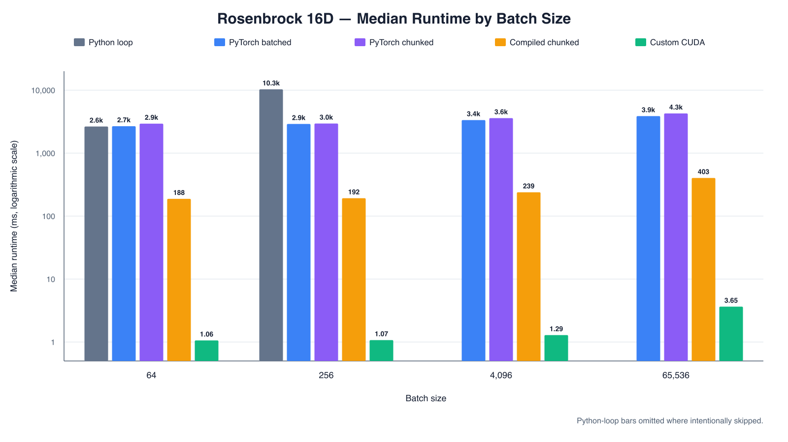

# Batched strong-Wolfe BFGS

*Created with the help of agentic coding tools.*

This repository compares implementations of full-memory BFGS with a
strong-Wolfe line search. Every optimizer implements the shared `Bfgs`
interface and returns the same batched result fields, making correctness and
timing comparisons direct.

## Implementations

| Variant | Class | Execution model | Intended use |
| --- | --- | --- | --- |
| Python loop | `LoopBfgs` | Runs each batch member independently in Python. | Readable reference implementation and correctness baseline. |
| PyTorch (naive) | `VectorizedBfgs` | Uses masked batched tensor operations. | Simple tensor implementation. |
| PyTorch (chunked) | `ChunkedVectorizedBfgs` | Runs several tensor iterations before checking convergence. CUDA checks copy one reduced activity flag to pinned host memory on a separate stream. | Reduces CPU/GPU synchronization while preserving eager PyTorch control flow. |
| PyTorch (compiled chunked) | `CompiledChunkedVectorizedBfgs` | Compiles one fixed-shape tensor iteration with TorchInductor while keeping chunk and event control eager. | Measures steady-state compiled performance when batch shape and optimizer settings remain stable. Compilation latency is reported separately. |
| Fused CUDA | `CudaBfgs` | Assigns one complete fixed-dimensional optimization to each CUDA thread, including its line search and inverse-Hessian state. | Maximum fusion and explicit per-thread memory control for supported dimensions. |

The loop and PyTorch variants store a full inverse Hessian for every batch
member. The fused kernel instead keeps the optimization inside one CUDA launch;
this removes repeated framework launches but constrains dimensions and increases
per-thread register or local-memory pressure.

## Current scope

The benchmark defaults to 16-dimensional extended Rosenbrock: eight independent
two-variable Rosenbrock blocks with a known all-ones minimizer. The Python and
PyTorch implementations accept any positive even dimension. The fused CUDA
kernel accepts 2D and 16D inputs.

The package exposes two top-level commands:

- `batched-bfgs benchmark` runs the standard implementation matrix; add
  `--compiled` to run the compiled chunked variant instead.
- `batched-bfgs profile-cuda` runs one warmed fused-CUDA workload with an NVTX
  range for profiling.

## Documentation

- [How to run](docs/how-to-run.md): local setup, standard and compiled
  benchmarks, CUDA profiling, and GCP Spot VM infrastructure.
- [Static checks](docs/static-checks.md): linting, formatting, type checking,
  tests, the pre-push hook, and GitHub Actions.
